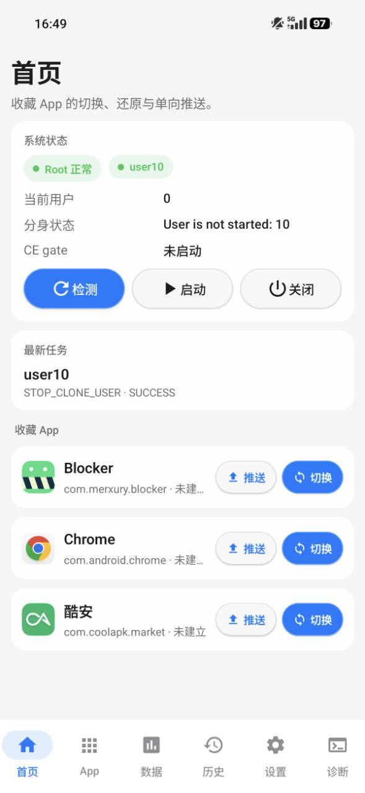
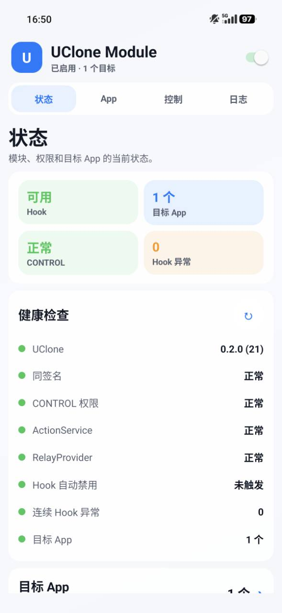
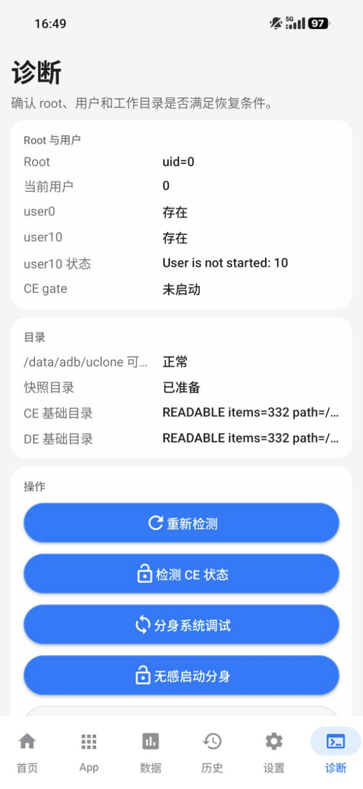
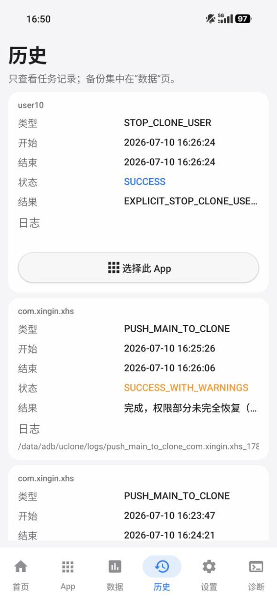

# UClone Restore / 分身登录态恢复器

UClone Restore 是一个面向 Android Root / HyperOS 多用户环境的本地数据恢复工具。它的核心目标是：在主系统 `user0` 中运行，通过 root 读取或写入分身系统 `user10` 的 App 数据，让同一台设备上的主系统和分身系统可以按需切换、恢复、推送 App 状态。

English documentation: [README.en.md](README.en.md)

## 当前版本

- 主 App：`0.3.1`
- 桌面长按模块：`0.3.1`
- 主要测试环境：小米 / HyperOS，多用户为 `user0` + `user10`，Root 为 KernelSU / KernelSU Next 一类方案

## 界面预览

| 主 App 首页 | UClone Module 状态 |
| --- | --- |
|  |  |
| **诊断与分身控制** | **任务历史** |
|  |  |

## 它能做什么

当前版本支持这些方向：

- 从分身系统 `user10` 读取 App 数据，恢复到主系统 `user0`。
- 从主系统 `user0` 推送 App 数据到分身系统 `user10`。
- 建立分身侧主动快照，后续可从快照恢复到主系统。
- 在切换、恢复、推送前自动生成被动备份，用于回滚。
- 恢复分身侧回滚备份，用于撤销一次推送。
- 尝试迁移运行时权限和 AppOps。Android 不允许 shell 稳定恢复的权限会记录为 warning。
- 将同一 APK 直接安装到另一用户，并可选择迁移权限或继续同步数据。
- 通过 LSPosed 桌面长按模块，在桌面 App 图标长按菜单中增加 UClone 快捷入口。

它不是云同步工具，也不是双端实时同步工具。所有数据都保存在本机 root 目录下，默认路径是：

```text
/data/adb/uclone
```

## 重要概念

### 主系统和分身系统

- 主系统：Android `user0`，UClone Restore 默认安装并运行在这里。
- 分身系统：通常是 Android `user10`，用于保存另一套 App 数据和登录态。

### CE / DE 数据

- CE 数据：`/data/user/<userId>/<pkg>`，只有该用户解锁后才可靠可读。
- DE 数据：`/data/user_de/<userId>/<pkg>`，Direct Boot 阶段也可用。

如果需要读取分身登录态，分身系统必须是 `RUNNING_UNLOCKED`。当前版本可以配置分身 PIN / 密码，在需要读取分身 CE 数据时自动尝试无感启动和解锁。

### 主动备份和被动备份

- 主动备份：用户手动建立的快照，主要来自分身系统，用于后续恢复。
- 被动备份：恢复、切换、推送前自动生成的备份，用于撤销这次操作。
- 切换回滚点：点击“切换”前自动保存的主系统原始状态。切换成功后，同一个按钮会变成“还原”。
- 分身回滚：推送主系统数据到分身前，自动保存的分身原始状态。

## 安装

每次发布会提供两个 APK：

- `uclone-restore-v0.3.1-release.apk`：主 App。
- `uclone-launcher-module-v0.3.1-release.apk`：桌面长按 LSPosed 模块。

安装命令示例：

```bash
adb install -r uclone-restore-v0.3.1-release.apk
adb install -r uclone-launcher-module-v0.3.1-release.apk
```

如果从旧的 debug 签名版本升级，Android 可能会因为签名不同拒绝覆盖安装。这种情况下需要先卸载旧版，再安装 release 版。

## 第一次使用

### 1. 打开主 App

UClone Restore 应安装在主系统 `user0`。打开后先进入首页，点击“检测”，确认：

- Root 正常。
- 当前用户是 `0`。
- 分身用户 `user10` 存在。
- `/data/adb/uclone` 可写。

### 2. 设置用户和路径

进入“设置”页：

- 主系统 ID：默认 `0`。
- 分身系统 ID：默认 `10`。
- Root 数据目录：默认 `/data/adb/uclone`。

除非你的设备 userId 不同，否则不要改这些值。

### 3. 设置分身自动解锁

如果你希望 UClone 在分身未启动或未解锁时自动处理：

1. 打开“分身自动解锁”。
2. 填入分身系统的 PIN / 密码。
3. 保存设置。

密码使用 Android Keystore 的 AES-GCM 密钥加密保存在 user0，并通过标准输入传给 root shell，不会写入 `su -c` 命令参数：

```text
cmd lock_settings verify --old <PIN> --user 10
```

日志只记录是否配置和长度，不记录明文。

### 4. 设置数据任务完成后是否关闭分身

“数据任务后关闭临时分身”只对需要读取或写入 user10 的备份、切换、推送和分身回滚任务生效，并且只关闭本次任务自动启动的分身。

- 如果分身原本没有启动，UClone 为了任务启动并解锁它，任务完成后可以自动关闭。
- 如果分身本来已经启动，UClone 不应该因为一次切换或恢复把它关闭。
- 诊断页的“无感启动分身”用于保持 user10 解锁运行，不受自动关闭设置影响。

### 5. 选择数据范围

默认建议：

- 开启 CE 数据。
- 开启 DE 数据。
- 开启 external Android/data。
- 按需开启 Android/media 和 OBB。
- 权限 / AppOps 可开启，但属于 best-effort。
- 保持排除 `cache` 和 `code_cache`。

UClone 永远不会复制 `/data/misc/keystore`。依赖 Android Keystore 的 App 即使文件恢复成功，也可能仍需要重新登录。

## 常用操作

### A. 把分身登录态恢复到主系统

适合场景：你在分身系统登录了某个 App，希望主系统也变成分身的状态。

操作：

1. 确保主系统和分身系统都安装了同一个 App。
2. 在 UClone 的 App 页找到目标 App。
3. 进入详情页，确认数据范围。
4. 点击“从分身最新恢复”或在首页收藏 App 后点击“切换”。

执行过程：

1. 检查分身是否解锁。
2. 从 `user10` 读取目标 App 数据。
3. 自动备份当前 `user0` 数据。
4. 将分身数据恢复到 `user0`。
5. 修正 UID / GID 和 SELinux context。
6. 记录切换回滚点。

切换成功后，首页收藏列表中的按钮会从“切换”变为“还原”。

### B. 还原主系统原始状态

适合场景：你刚刚把主系统切换成分身状态，现在想恢复切换前的主系统数据。

操作：

1. 在首页收藏 App 中点击“还原”。
2. 或在 App 详情页点击“还原主系统态”。

默认情况下，它会使用切换前自动生成的被动备份恢复主系统数据。还原成功后，切换标记会被清除，按钮重新变成“切换”。

如果在“设置 -> 切换同步”中开启“强制更新分数据”，还原会按以下顺序执行：

1. 把主系统中当前正在使用的分身态数据同步回 `user10`。
2. 为分身当前数据建立回滚保护并完成同步校验。
3. 同步成功后，才恢复切换前的主数据。
4. 主数据恢复成功后清除切换标记。

如果第一步失败，UClone 不会继续还原主数据，也不会清除切换标记，避免丢失本次分身态使用期间产生的新数据。开启后会多执行一次完整数据推送，耗时和临时空间占用会增加。

### C. 建立主动备份

适合场景：你想保存当前分身系统中某个 App 的黄金状态，之后随时恢复到主系统。

操作：

1. 进入 App 页。
2. 选择目标 App。
3. 点击“建立主动备份”。

备份会保存到：

```text
/data/adb/uclone/snapshots/<包名>/active
```

历史快照会保存在：

```text
/data/adb/uclone/snapshots/<包名>/history/<时间>
```

### D. 推送主系统数据到分身

适合场景：你希望分身系统使用主系统当前状态。

操作：

1. 在首页收藏 App 中点击“推送”。
2. 或进入 App 详情页执行推送到分身。

执行过程：

1. 检查或自动解锁分身系统。
2. 备份当前分身系统数据，形成分身回滚。
3. 将主系统数据恢复到分身系统。
4. 修正分身侧 UID / GID 和 SELinux context。

如果推送后想撤销，可以在数据页或详情页恢复分身回滚。

### E. 使用桌面长按快捷入口

安装模块 APK 后：

1. 打开 LSPosed。
2. 给 UClone Module 设置作用域，只勾选 `com.miui.home`。
3. 重启桌面或重启手机。
4. 打开 UClone Module 设置页。
5. 在 App 页勾选允许显示 UClone 菜单的目标 App。
6. 在 UClone Restore 主 App 设置中打开“允许模块控制”。
7. 首次打开 UClone Restore 时允许通知权限，用于显示快捷任务的进度和结果。

之后在桌面长按目标 App 图标，会出现 UClone 入口。

模块只负责显示入口和转发请求。真正的 root 操作、备份、恢复、日志、通知都由 UClone Restore 主 App 执行。

Android 15 及以上会限制 `dataSync` 类型前台服务的后台累计运行时间。Android 14 及以上，UClone 的外部任务服务统一使用已声明用途的 `specialUse` 前台服务类型，避免桌面长按或主 App 冷启动时因 `dataSync` 时限耗尽而在通知出现前失败。如果手机仍显示 `0.2.0`，必须同时更新主 App 和模块后，这项修复才会生效。

### F. 把 App 安装到另一用户

适合场景：目标 App 只安装在主系统或只安装在分身，希望在另一侧启用同一个 APK。

进入 App 详情页后，“跨用户安装”提供三种模式：

- 仅安装到另一用户：执行 `cmd package install-existing --user`，不迁移权限或数据。
- 安装并迁移权限/AppOps：安装后迁移 Android 允许 shell 设置的权限状态，不复制 App 数据。
- 安装并同步数据：安装后复用现有推送或分身恢复流程，先建立必要回滚，再写入目标数据。

UClone 不复制 `/data/app`，两侧使用系统中同一个 APK 版本。仅安装和权限迁移不会启动或解锁分身；只有同步数据需要读取分身 CE 时，才会按设置尝试自动解锁。安装成功但后续同步失败时，任务会显示“成功（有警告）”，并保留目标侧安装结果，不会自动卸载。

系统 App 默认不显示跨用户安装工具。确有需要时，可在“设置 → 高级安装”中开启，执行前仍会再次确认。该开关只允许在另一用户启用系统现有 APK 及迁移可支持的权限，不放开系统 App 数据备份、切换或覆盖。UClone 自身始终禁止跨用户安装。

## 页面说明

### 首页

首页用于快速操作：

- 查看 Root、当前用户、分身状态。
- 显示最新任务。
- 显示收藏 App。
- 对收藏 App 执行“切换 / 还原”和“推送”。

### App 页

App 页用于选择目标应用：

- 搜索 App 名称或包名。
- 筛选全部、双系统 App、用户 App、系统 App。
- 收藏 App。
- 进入详情页执行备份、恢复、推送、删除快照等操作。
- 对仅在单侧安装的 App 执行跨用户安装、权限迁移或安装后同步。

“双系统 App”表示主系统和分身系统都安装的 App。

### 数据页

数据页用于集中管理备份：

- 主动备份：用户手动建立的 active 快照。
- 被动备份：切换、恢复、推送前自动生成的回滚备份。
- 分身回滚：推送主系统数据到分身前保存的分身原始数据。

数据详情页只提供恢复和删除，不提供 App 详情页里的数据范围设置。

### 历史页

历史页显示任务记录，包括成功、失败、运行中任务。失败任务可以查看日志路径和错误摘要。

### 设置页

设置页包含：

- 用户 ID。
- Root 数据目录。
- 分身自动解锁。
- 数据任务后关闭本次临时启动的分身。
- 强制更新分数据：默认关闭；开启后，还原主数据前先把主系统当前分身态数据同步回分系统。
- 默认数据范围。
- 模块控制开关。
- 系统 App 跨用户安装高级开关。
- 旧备份容量归属的只读扫描与手动修复。
- 重置 UClone 数据。

重置会删除备份、记录、日志、临时文件等所有 UClone 数据，需要二次确认。

### 诊断页

诊断页用于设备调试：

- 探测分身 CE 状态。
- 尝试无感启动和解锁分身。
- 分身系统调试。
- 生成恢复一致性审计。
- 清理日志。

## 存储结构

默认根目录：

```text
/data/adb/uclone
```

主要目录：

```text
/data/adb/uclone/snapshots/<pkg>/active
/data/adb/uclone/snapshots/<pkg>/history/<timestamp>
/data/adb/uclone/rollback/<pkg>/<timestamp>
/data/adb/uclone/clone_rollback/<pkg>/latest
/data/adb/uclone/switches/<pkg>/active
/data/adb/uclone/logs
/data/adb/uclone/tmp
/data/adb/uclone/audit
```

不建议把快照默认放到 `/sdcard/Documents`，因为里面可能包含 App 私有数据和登录态。

## 日志和排错

每个 root 任务都会记录：

- TASK。
- PACKAGE。
- START。
- ROOT 身份。
- STDOUT。
- STDERR。
- EXIT。

日志默认在：

```text
/data/adb/uclone/logs
```

常见判断：

- `RUNNING_UNLOCKED`：分身 CE 数据可读取。
- `RUNNING_LOCKED`：分身已启动但 CE 不可用，需要解锁。
- `User is not started`：分身未启动。
- `ERR_CLONE_PIN_VERIFY_FAILED`：分身 PIN / 密码不匹配。
- `WARN_GRANT_FAILED` / `WARN_APPOPS_FAILED`：权限或 AppOps 部分恢复失败，文件数据可能仍已恢复成功。

## 发布和构建

GitHub Actions 会在每次 push 到 `main` 后构建：

- 主 App release APK。
- 桌面模块 release APK。

Release 签名使用仓库 secrets：

- `RELEASE_KEYSTORE_BASE64`
- `RELEASE_STORE_PASSWORD`
- `RELEASE_KEY_ALIAS`
- `RELEASE_KEY_PASSWORD`

本地调试构建示例：

```bash
gradle --no-daemon :app:assembleDebug
gradle --no-daemon :launcher-module:assembleDebug
```

## 安全边界

- 所有核心命令通过 `su -c` 执行。
- 恢复前必须备份目标用户当前数据。
- 恢复后必须修正 UID / GID 和 SELinux context。
- 不复制 `/data/misc/keystore`。
- 不默认允许模块控制系统 App 或 UClone 自身。
- 删除和重置属于高风险操作，执行前需要确认。

## 已知限制

- HyperOS 和 Android 多用户行为会随 ROM 版本变化。
- 严格 App 执行门禁需要系统提供 `cmd package unstop` 来恢复任务前的 stopped 状态；Android 15/16 支持该命令，缺少此能力的旧系统会在修改 App 状态和数据前安全拒绝任务。
- 权限 / AppOps 迁移是 best-effort，不保证所有特殊权限都能自动恢复。
- 无障碍、通知读取、VPN、设备管理员、默认应用、部分小米后台策略可能需要用户手动在系统设置里重新开启。
- 使用 Android Keystore 的 App 可能无法完整迁移密钥。
- 桌面长按模块依赖 MIUI / HyperOS Launcher 内部类名，桌面更新后可能需要适配。

## Figma 草案

https://www.figma.com/design/bVBjSk3xsciEOkTSXbHHNV
