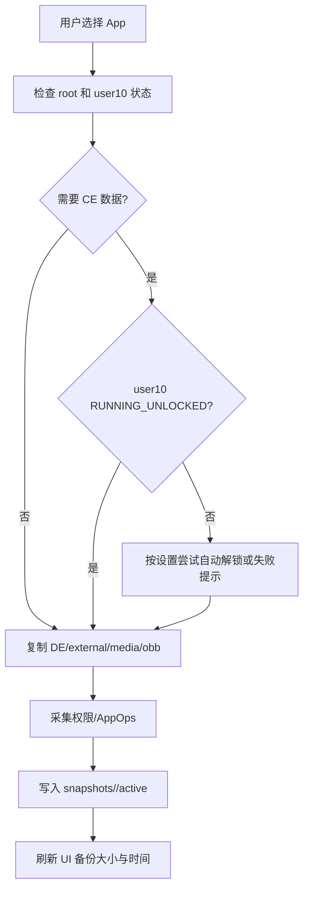
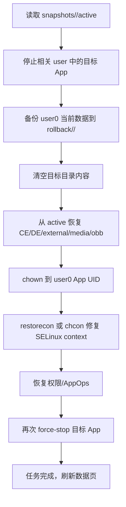
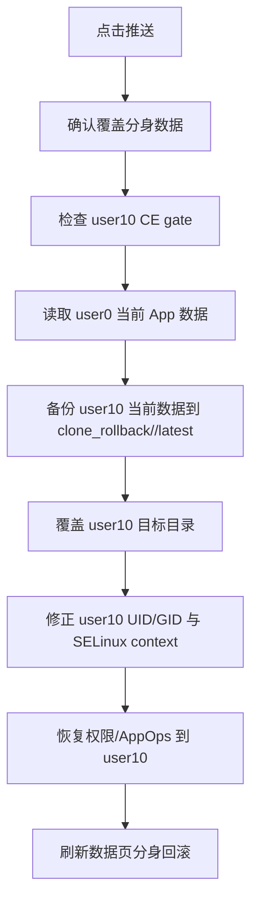
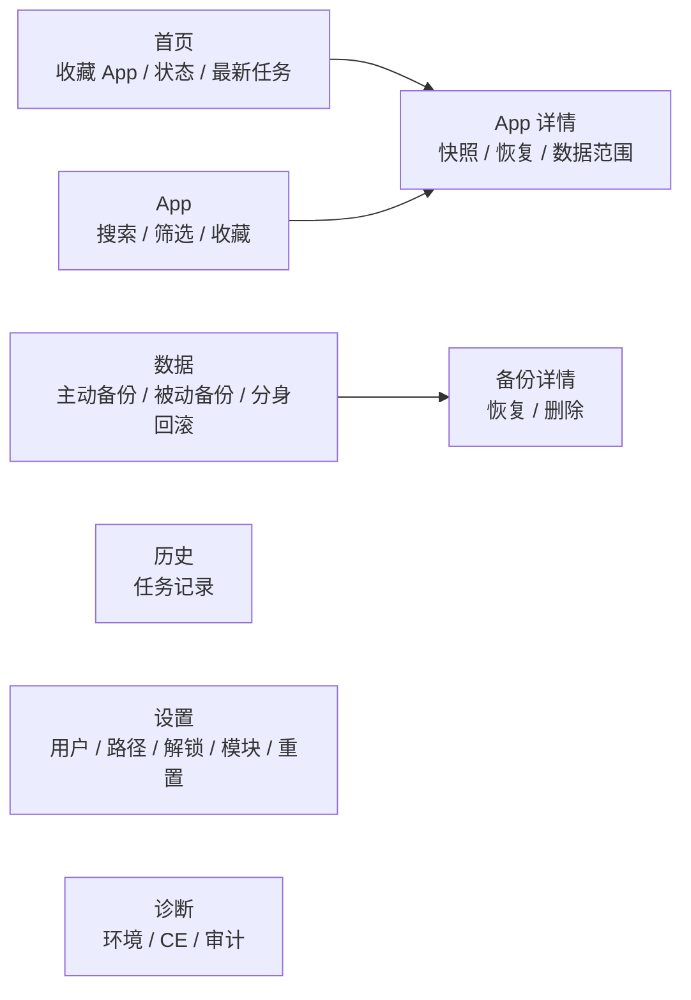

# UClone Restore 产品设计说明书

- 文档版本: 0.2 draft
- 对应应用: UClone Restore / 分身登录态恢复器
- 更新日期: 2026-07-09
- 适用阶段: 0.1 已验证功能 + 0.2 开发中能力

## 1. 项目概述

UClone Restore 是一个面向 Android Root / HyperOS 多用户环境的 App 数据恢复工具。它不是普通备份软件，也不是文件管理器，而是围绕“同一 App 在主系统 user0 与分身系统 user10 之间的登录态迁移”建立的专用工具。

第一阶段的核心目标是:

- UClone Restore 只安装并运行在主系统 `user0`。
- 通过 root 从分身系统 `user10` 读取目标 App 数据。
- 建立分身侧“黄金快照”。
- 后续把该快照恢复到主系统 `user0`。
- 每次覆盖前强制保存目标侧当前状态，提供回滚能力。

0.2 阶段开始扩展为更完整的跨 user 数据工具:

- 主系统可以把当前 App 数据单向推送到分身系统。
- 推送前保存分身侧最新回滚点。
- 预留外部模块控制协议，后续由 Xposed / LSPosed / KernelSU 模块在桌面长按 App 图标时触发操作。
- 为将来支持 UClone Restore 在分身系统内使用，补充分身系统调试与同步模型。

## 2. 产品定位

### 2.1 目标用户

- 已 root 的 Android / HyperOS 用户。
- 使用系统分身、手机分身、Second Space 或多用户环境的用户。
- 希望把分身 App 登录态临时切换到主系统使用的用户。
- 希望在主系统与分身系统之间快速切换同一 App 数据状态的高级用户。

### 2.2 主要使用场景

1. 分身 App 已登录，主系统 App 是另一个账号。
2. 用户希望主系统 App 临时变成分身登录态。
3. 使用完成后，用户希望一键还原主系统原来的账号和数据。
4. 用户希望把主系统当前数据推送到分身系统，形成另一方向的单向覆盖。
5. 用户希望未来不打开 UClone Restore，也能从桌面 App 长按菜单触发切换。

### 2.3 非目标

当前阶段不做以下能力:

- 不做普通文件备份管理器。
- 不复制或恢复 `/data/misc/keystore`。
- 不承诺恢复使用 Android Keystore 强绑定密钥的 App 登录态。
- 不做定时同步。
- 不做云端备份。
- 不让外部模块直接执行 root 数据复制逻辑。
- 不默认允许系统 App 或 UClone Restore 自身被外部模块控制。

## 3. 核心概念

### 3.1 用户空间

| 名称 | 默认 userId | 说明 |
| --- | ---: | --- |
| 主系统 | `0` | UClone Restore 默认安装和运行的位置 |
| 分身系统 | `10` | 目标分身环境，数据来源或推送目标 |

Android 多用户下，同一包名在不同 user 中拥有独立的数据目录和 UID。恢复时不能简单复制文件，必须根据目标 user 的包 UID 修正 owner，并恢复 SELinux context。

### 3.2 数据范围

| 范围 | 路径示例 | 默认 |
| --- | --- | --- |
| CE App 私有数据 | `/data/user/<userId>/<pkg>` | 开启 |
| DE Device Protected 数据 | `/data/user_de/<userId>/<pkg>` | 开启 |
| external Android/data | `/data/media/<userId>/Android/data/<pkg>` | 开启 |
| Android/media | `/data/media/<userId>/Android/media/<pkg>` | 关闭 |
| OBB | `/data/media/<userId>/Android/obb/<pkg>` | 关闭 |
| 权限/AppOps | `dumpsys package`, `cmd appops` | 开启 |
| cache/code_cache | `cache`, `code_cache` | 默认排除 |

### 3.3 工作目录

默认 root 工作目录:

```text
/data/adb/uclone
```

主要子目录:

| 目录 | 用途 |
| --- | --- |
| `snapshots/<pkg>/active` | 主动快照，默认用于恢复到主系统 |
| `snapshots/<pkg>/history/<time>` | 历史主动快照，预留 |
| `rollback/<pkg>/<id>` | 主系统被动备份，恢复/切换前自动生成 |
| `clone_rollback/<pkg>/latest` | 分身侧被动备份，推送到分身前自动生成 |
| `switches/<pkg>/active` | 当前处于“已切换，可还原”的标记 |
| `logs` | 任务日志 |
| `tmp` | 任务临时目录 |
| `audit` | 恢复一致性审计包 |
| `config` | 预留配置目录 |

## 4. 功能范围

### 4.1 环境检测

目的: 判断设备是否满足执行 root 数据操作的前置条件。

检测内容:

- root 是否可用。
- 当前运行 user。
- user0 / user10 是否存在。
- user10 当前状态。
- user10 CE/DE 根目录可读性。
- `/data/adb/uclone` 是否可写。
- `snapshots`、`rollback`、`logs`、`tmp` 等目录是否可创建。

关键判断:

- 需要读取分身 CE 数据时，user10 必须是 `RUNNING_UNLOCKED`。
- user10 未启动或已启动但未解锁时，不能把 CE 数据缺失当成成功。

### 4.2 分身自动解锁

目的: 在需要读取 user10 CE 数据时，尽量无感启动并解锁分身系统。

设置项:

- `分身自动解锁`: 默认关闭。
- `分身锁屏 PIN/密码`: 保存在 user0 的 App 私有设置中，日志只记录长度，不记录明文。

执行逻辑:

1. 检查 user10 状态。
2. 若已 `RUNNING_UNLOCKED`，直接继续。
3. 若未启动，执行 `am start-user -w <cloneUserId>`。
4. 若仍未解锁，执行 `cmd lock_settings verify --old <PIN> --user <cloneUserId>`。
5. 循环检测状态，直到 `RUNNING_UNLOCKED` 或超时。
6. 如果本次任务启动了分身，并且设置允许任务后关闭，则任务结束后关闭 user10。

失败处理:

| 失败类型 | 用户提示 |
| --- | --- |
| 自动解锁关闭 | 分身未解锁，请开启分身自动解锁或先手动解锁 |
| 未填写 PIN | 请先在设置中填写分身锁屏 PIN/密码 |
| PIN 错误 | 分身 PIN 验证失败 |
| 系统限流 | PIN 验证被系统限流，请稍后再试 |
| 统一锁屏凭据不支持 | 分身使用统一锁屏凭据，当前系统不支持后台验证 |
| 超时 | 分身解锁超时，请确认 PIN 和系统状态 |

### 4.3 建立分身快照

目的: 从分身 user10 读取目标 App 数据，建立主动快照。

流程:



关键约束:

- 禁止同步 UClone Restore 自身。
- 默认排除 `cache` 与 `code_cache`。
- 保留 `app_webview`，因为部分 App 登录态可能依赖 WebView 数据。
- 不处理 Android Keystore。

### 4.4 恢复到主系统

目的: 将主动快照恢复到 user0。

流程:



安全策略:

- 覆盖前一定生成被动备份。
- 恢复路径必须匹配白名单，例如 `/data/user/0/<pkg>`。
- 恢复源必须位于预期目录，例如 `snapshots/<pkg>/active`。
- restore 任务失败时不写成功状态。

### 4.5 一键切换 / 还原

目的: 首页收藏 App 提供更短路径的临时账号切换。

按钮状态:

| 状态 | 按钮 |
| --- | --- |
| 未切换 | 切换 |
| 已切换且存在 switch marker | 还原 |

切换逻辑:

1. 从分身 user10 读取最新数据到临时目录。
2. 恢复到主系统 user0。
3. 恢复前自动保存 user0 原状态。
4. 写入 `switches/<pkg>/active`，记录可还原的 rollback id。
5. 首页按钮变为“还原”。

还原逻辑:

1. 读取 `switches/<pkg>/active`。
2. 用对应 `rollback/<pkg>/<id>` 恢复 user0 原状态。
3. 清除 switch marker。
4. 首页按钮变回“切换”。

重要规则:

- 清理任务日志不能影响 switch marker。
- 删除被动备份时，如果它正被 switch marker 使用，需要同步清除无效 marker。
- 切换/还原的被动备份每个 App 只保留最新关键记录，避免数据页被大量重复记录占满。

### 4.6 主系统推送到分身

目的: 在 0.2 中提供 user0 到 user10 的单向覆盖能力。

入口:

- 首页收藏 App 行: `推送` 按钮。
- 外部模块协议: `PUSH_MAIN_TO_CLONE`。

流程:



设计原则:

- 推送不写入 `switches/<pkg>/active`。
- 推送不会改变首页“切换/还原”按钮状态。
- 推送前的分身备份放在 `clone_rollback/<pkg>/latest`。
- 每个 App 只保留一个最新分身回滚，避免大量重复占用空间。
- 数据页可以手动把 `clone_rollback/<pkg>/latest` 恢复回分身。

### 4.7 数据页

数据页是备份集中管理入口，而不是 App 操作页。

分组:

- 主动备份: `snapshots/<pkg>/active`
- 被动备份: `rollback/<pkg>/<id>`
- 分身回滚: `clone_rollback/<pkg>/latest`

数据页详情原则:

- 只提供和备份本身有关的操作。
- 主动备份详情: 恢复、删除。
- 被动备份详情: 恢复、删除。
- 分身回滚: 恢复到分身。
- 不显示 App 页中的数据范围开关和建立快照等操作。

### 4.8 历史页

历史页只展示任务记录:

- 任务类型。
- 包名。
- 状态。
- 开始/结束时间。
- 简要消息。

备份数据不再混在历史页中，避免“任务日志”和“可恢复数据”混淆。

### 4.9 设置页

设置项:

- 主系统 ID。
- 分身系统 ID。
- root 工作目录。
- 分身自动解锁。
- 分身锁屏 PIN/密码。
- 任务完成后关闭分身系统。
- 模块控制开关。
- 默认数据范围。
- 清理任务日志。
- 重置所有 UClone 数据。

重置逻辑:

- 二次确认后执行。
- 删除 UClone 工作目录下的备份、日志、审计包、切换标记和临时文件。
- 不删除 root 工作目录本身。
- 不删除任何真实 App 数据目录。
- 仅允许 root 工作目录最后一级目录名包含 `uclone`，避免误删。

### 4.10 诊断页

诊断页用于真实设备排错:

- 环境检测。
- 探测分身 CE。
- 无感启动分身。
- 分身系统调试。
- 恢复一致性审计。
- 查看 root、用户、目录状态。

诊断任务原则:

- `分身系统调试` 是只读任务，不启动/关闭用户，不复制数据，不删除文件。
- 审计任务只采集证据，不执行恢复或删除。

### 4.11 外部模块协议

目的: 为未来桌面长按 App 图标直接触发 UClone 操作预留接口。

组件:

```text
com.uclone.restore/.external.ExternalActionService
```

权限:

```text
com.uclone.restore.permission.CONTROL
```

保护级别:

```text
signature
```

支持操作:

```text
SWITCH_OR_RESTORE
SWITCH_TO_CLONE
RESTORE_MAIN
BACKUP_DEFAULT
RESTORE_LATEST_BACKUP
PUSH_MAIN_TO_CLONE
RESTORE_LATEST_CLONE_ROLLBACK
```

安全规则:

- 设置页默认关闭模块控制。
- 不允许控制 UClone Restore 自身。
- 默认不允许控制系统 App 或 updated-system App。
- 外部模块只负责展示入口和发送请求。
- root 复制、恢复、状态判断必须仍由 UClone Restore 执行。
- UI 任务和外部模块任务共用全局 busy gate，避免并发覆盖。

## 5. 信息架构



底部导航:

- 首页
- App
- 数据
- 历史
- 设置
- 诊断

二级页面必须提供返回按钮，避免系统手势直接退出 App。

## 6. 状态模型

### 6.1 user10 CE 状态

```kotlin
sealed class User10CeState {
    data object Unavailable
    data object StartedLocked
    data object RunningUnlocked
    data object NotStarted
    data class Unknown(val raw: String)
}
```

核心规则:

- `RunningUnlocked`: 允许读取 CE。
- `StartedLocked`: 禁止读取 CE，除非自动解锁成功。
- `NotStarted`: 可尝试启动并验证 PIN。
- `Unavailable` 或 `Unknown`: 禁止执行需要 CE 的任务。

### 6.2 App 操作状态

当前 UI 主要根据以下数据计算按钮:

- App 是否在 user0 安装。
- App 是否在 user10 安装。
- active snapshot 是否存在。
- switch marker 是否存在。
- 最新任务是否运行中。
- user10 CE gate 是否允许。

后续建议集中为 `AppActionStateResolver`，避免 UI 分散判断。

### 6.3 任务状态

任务状态:

- `RUNNING`
- `SUCCESS`
- `FAILED`

步骤状态:

- `PENDING`
- `RUNNING`
- `SUCCESS`
- `FAILED`

任务执行特点:

- 所有核心任务通过 root shell 执行。
- stdout / stderr / exitCode 写入任务日志。
- UI 首页和详情页显示最新任务进度。
- 外部模块任务也返回状态广播。

## 7. 技术路线

### 7.1 Android 技术栈

- Kotlin
- Jetpack Compose
- Material 3
- Android Foreground Service
- Android dynamic shortcuts
- Root shell via `su -c`

### 7.2 Root 执行层

所有核心命令统一通过 `RootShellExecutor` 执行:

- 优先使用 `su --mount-master -c`。
- 如果环境不支持 mount master，回退到 `su -c`。
- 捕获 stdout、stderr、exitCode。
- 任务脚本使用 shell 字符串生成，并通过严格路径白名单约束删除和恢复目标。

### 7.3 数据复制策略

使用目录快照或 tar 流式复制:

```sh
(cd "$SRC" && tar -cpf - .) | (cd "$DST" && tar -xpf -)
```

原因:

- 避免生成 1GB+ 单个 tar 文件。
- 保留目录结构和文件属性。
- 便于在临时目录验证非空后再替换目标目录。

### 7.4 UID/GID 与 SELinux 修复

恢复到目标 user 后必须:

1. 读取目标 user 中该包的 UID。
2. `chown -R <targetUid>:<targetUid>` 修复 CE/DE。
3. external 数据使用合适 media group。
4. 对 `cache` / `code_cache` 使用派生 cache gid。
5. `restorecon -RF` 或 `chcon` 修复 SELinux context。

### 7.5 权限/AppOps 迁移

采集:

- `dumpsys package <pkg>` 中的 runtime grants。
- `cmd appops get --user <userId> <pkg>` 中的 AppOps。

恢复:

- 先撤销目标侧快照中不存在的 runtime grants。
- 再对快照中存在的 grants 执行 `cmd package grant` 或 `pm grant`。
- 对 AppOps 执行 `cmd appops reset` 后再 replay 支持的 op/mode。

限制:

- 特殊访问权限不保证全自动恢复。
- 小米/HyperOS 特殊后台策略、无障碍、通知使用权、设备管理员、VPN、默认应用等需要单独研究或引导用户设置。

### 7.6 外部模块控制路线

模块只负责 UI 注入:

- 桌面长按 App 图标。
- 增加“切换 / 还原 / 备份 / 推送”等菜单项。
- 根据模块自己的 per-app 设置决定是否显示。

UClone Restore 负责实际执行:

- 校验签名权限。
- 校验模块控制开关。
- 校验目标包。
- 串行化任务。
- 执行 root 恢复逻辑。
- 广播结果。

这样可以避免模块本身持有复杂 root 脚本，也降低并发覆盖风险。

## 8. 安全设计

### 8.1 删除安全

所有删除操作必须满足:

- 删除路径在 UClone 工作目录或目标 App 白名单路径内。
- 不允许删除 `/`。
- 不允许把变量为空时拼出危险路径。
- 删除 active 快照只允许 `snapshots/<pkg>/active`。
- 删除被动备份只允许 `rollback/<pkg>/<id>`。
- 重置只允许删除固定 UClone 子目录。

### 8.2 并发安全

风险:

- UI 任务和外部模块任务同时运行。
- 多次点击导致恢复和推送交错。
- 前台服务异常导致 busy 状态泄漏。

策略:

- `SyncEngine` 维护全局 `operationBusy`。
- UI 任务和外部服务共用同一个 busy gate。
- 服务启动失败也释放 busy。
- 任务结束统一刷新备份列表和 switch marker。

### 8.3 凭据安全

当前策略:

- PIN/密码仅保存在 user0 App 私有 SharedPreferences。
- 任务日志只记录是否配置、长度，不记录明文。

后续增强:

- 使用 Android Keystore 加密保存。
- 增加“仅本次输入，不落盘”模式。
- 增加凭据清除按钮。

### 8.4 外部控制安全

策略:

- 外部服务需要 signature 权限。
- App 内设置默认关闭模块控制。
- 拒绝控制系统 App。
- 拒绝控制 UClone 自身。
- 外部请求不直接携带 shell。
- UClone 是执行策略的唯一权威。

## 9. 主要流程详解

### 9.1 首次使用流程

1. 安装 UClone Restore 到主系统 user0。
2. 授予 KernelSU / Magisk root。
3. 打开设置，确认:
   - 主系统 ID = `0`
   - 分身系统 ID = `10`
   - root 工作目录 = `/data/adb/uclone`
4. 如需无感读取分身 CE:
   - 开启分身自动解锁。
   - 填写分身 PIN/密码。
5. 打开诊断页，执行环境检测。
6. 在 App 页搜索目标包并收藏。
7. 在首页执行切换、还原或推送。

### 9.2 快照恢复流程

1. 在 App 详情页点击建立主动备份。
2. 确认 user10 CE 可读。
3. 复制分身数据到 active snapshot。
4. 点击恢复到主系统。
5. 系统生成 user0 被动备份。
6. 覆盖 user0 目标 App 数据。
7. 打开主系统 App 验证登录态。

### 9.3 临时切换流程

1. 首页收藏 App 行点击“切换”。
2. UClone 直接读取分身最新数据，不一定写入 active snapshot。
3. 恢复到主系统。
4. 保存切换前 user0 数据并写 switch marker。
5. 首页按钮变成“还原”。
6. 用户点击“还原”恢复 user0 原状态。

### 9.4 推送到分身流程

1. 首页收藏 App 行点击“推送”。
2. 二次确认覆盖分身。
3. 检查 user10 CE gate。
4. 复制 user0 当前数据。
5. 备份 user10 当前数据到 `clone_rollback/<pkg>/latest`。
6. 覆盖 user10 数据。
7. 数据页出现分身回滚入口。

### 9.5 重置流程

1. 设置页点击“重置所有 UClone 数据”。
2. 第一次确认说明删除范围。
3. 第二次确认说明不可撤销。
4. Root 脚本删除固定 UClone 子目录。
5. UI 清空任务历史、备份列表、分身回滚、切换标记。

## 10. UI 设计原则

### 10.1 风格方向

- iOS / Apple 风格。
- Liquid Glass 轻玻璃质感。
- 紧凑信息布局。
- 一行一个 App。
- 按钮尺寸一致，避免纯文本按钮无样式。
- 路径使用单行横向滚动，避免换行撑破卡片。

### 10.2 页面职责

| 页面 | 职责 |
| --- | --- |
| 首页 | 收藏 App 的快捷操作、最新任务、系统状态 |
| App | 搜索、筛选、收藏、进入详情 |
| App 详情 | 单个 App 的备份/恢复/切换/删除/审计 |
| 数据 | 所有备份集中查看与恢复 |
| 历史 | 任务记录 |
| 设置 | 用户 ID、路径、解锁、模块、维护 |
| 诊断 | root / user / 路径 / CE / 审计 |

### 10.3 交互反馈

- 保存设置后显示 Toast。
- 高危操作使用确认弹窗。
- 删除和重置使用红色危险按钮。
- 任务运行时显示进度。
- 失败时显示人类可读错误，而不是只显示 shell stderr。

## 11. 质量与验收标准

### 11.1 功能验收

| 功能 | 验收标准 |
| --- | --- |
| 环境检测 | 能准确显示 root、当前 user、user10 状态、工作目录可写 |
| 自动解锁 | user10 未启动时可 start + verify PIN，并等待 RUNNING_UNLOCKED |
| 建立快照 | active 中 CE/DE/external 数据非空，manifest 正确 |
| 恢复到主系统 | user0 数据被覆盖，UID/GID/SELinux 修复，App 可打开 |
| 切换/还原 | 按钮状态准确，marker 正确写入/清除 |
| 推送到分身 | user10 数据被覆盖，clone_rollback/latest 可恢复 |
| 权限/AppOps | 可恢复项尽量 replay，失败项日志可见 |
| 重置 | 只删除 UClone 工作目录固定子目录，UI 状态清空 |
| 外部协议 | 默认拒绝，开关开启后同签名模块可触发 |

### 11.2 真机验收

需要在 rooted HyperOS 设备上覆盖这些状态:

- 主系统运行，分身未启动。
- 主系统运行，分身已启动但未解锁。
- 主系统运行，分身已解锁。
- 分身系统运行 UClone Restore 的调试任务。
- 目标 App 包含大体积 external 数据。
- 目标 App 使用权限/AppOps。

### 11.3 审计验收

恢复一致性审计至少收集:

- 文件树。
- `ls -lZ`。
- package dump。
- appops dump。
- UID/GID。
- user state。
- active manifest。
- summary。

结论分级:

- `PASS`
- `WARN_FILE_DIFF`
- `WARN_PERMISSION_DIFF`
- `WARN_APPOPS_DIFF`
- `FAIL_UID_OWNER`
- `FAIL_SELINUX`
- `FAIL_CE_LOCKED`
- `FAIL_PACKAGE_MISSING`

## 12. 已知限制与风险

### 12.1 Android Keystore

部分 App 登录态依赖 Android Keystore 中不可导出的密钥。即使文件数据恢复成功，App 仍可能要求重新登录。

### 12.2 CE 解锁能力依赖系统实现

`cmd lock_settings verify` 在目标设备上已经验证可用，但不同 ROM、不同锁屏策略、统一挑战凭据场景可能失败。

### 12.3 AppOps 不完全等价

AppOps 有 package mode 和 uid mode，部分 OEM AppOps 可能无法通过标准命令恢复。

### 12.4 外部存储与媒体权限

Android 版本差异、Scoped Storage、OEM 文件访问策略会影响 external/media/obb 的可读写行为。

### 12.5 大数据量性能

小红书等 App 数据可超过 1GB。需要避免单个大 tar 文件，使用流式复制，并通过进度日志反馈当前阶段。

## 13. 版本路线

### 0.1 已完成方向

- 主系统 user0 运行。
- 读取分身 user10 数据。
- 建立 active 快照。
- 恢复到主系统。
- 恢复前被动备份。
- 回滚。
- 数据页、历史页、设置页、诊断页。
- 自动关闭本次启动的分身。
- 固定签名和 release 发布流程。

### 0.2 当前方向

- 分身自动解锁开关。
- 主系统推送到分身。
- 分身回滚 `clone_rollback/latest`。
- 外部模块控制协议。
- 分身系统调试。
- 全局任务 busy gate。
- 设置页重置所有 UClone 数据。

### 后续方向

- 完整双向备份 manifest。
- 统一 `AppActionStateResolver`。
- 模块端桌面长按菜单。
- Keystore 风险提示。
- 权限/AppOps 更细粒度审计。
- 真机 Neo Backup 对比审计报告。
- PIN/密码加密保存或一次性输入模式。

## 14. 工程边界总结

UClone Restore 的核心价值不是“复制文件”，而是把 Android 多用户环境中的 App 数据恢复问题产品化:

- 在正确的 user 状态下读取数据。
- 在覆盖前保存目标状态。
- 在恢复后修正 UID/GID/SELinux。
- 在 UI 上避免主动备份、被动备份、切换标记、分身回滚混淆。
- 在外部模块接入时仍保持 UClone 自身作为唯一执行和安全判断中心。

只要这些边界保持清晰，后续无论是分身系统内运行、桌面长按 Hook，还是更完整的双向同步，都可以在同一套数据模型和安全策略上继续扩展。
